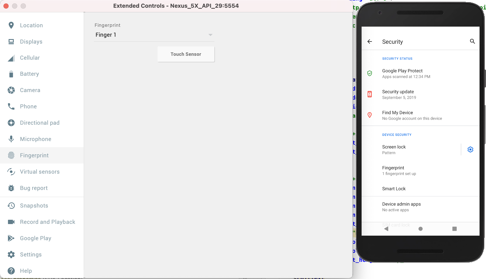
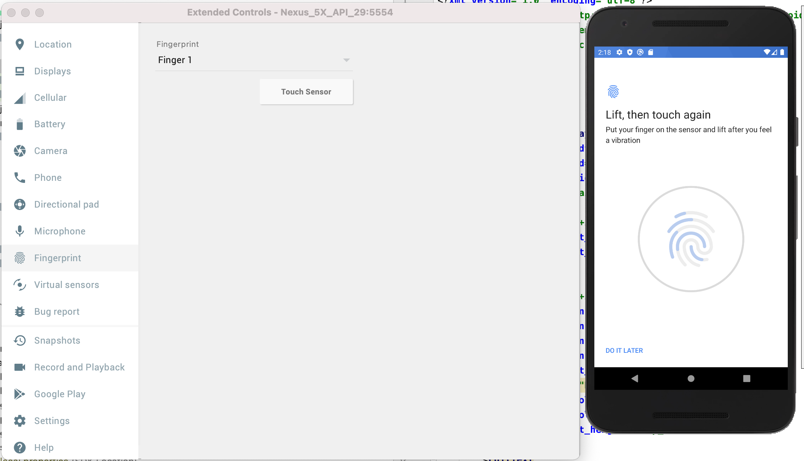
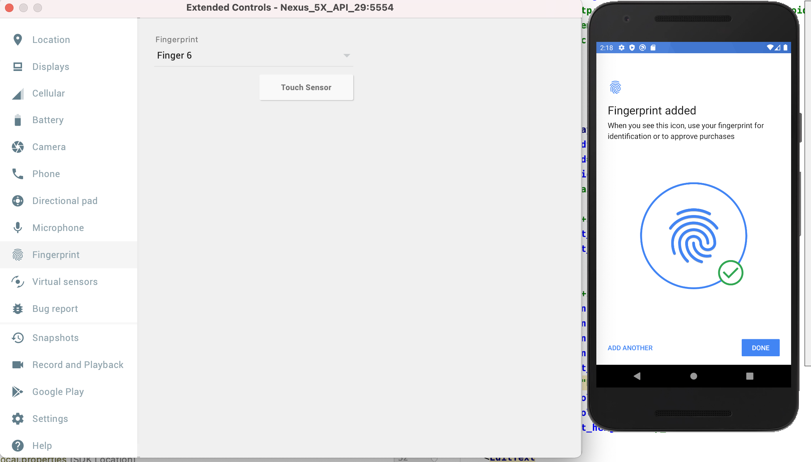

# Biometric Authentication
Biometric authentication involves using some part of your physical makeup to authenticate you. This could be a fingerprint, an iris scan, a retina scan, or some other physical characteristic. A single characteristic or multiple characteristics could be used.

## First Step
First you need to add a fingerprint to the emulator.
1. Install Android SDK Tools Revision 24.3, if you have not done so.
2. Enroll a new fingerprint in the emulator by going to Settings > Security > Fingerprint, then follow the enrollment instructions.<dt><dt>
 <dt>
  
  
### Then we press fingerprint and proceed
  A screen like this will open<dt>
     <dt>
            
We press the touch sensor and register a fingerprint.<dt>
       <dt>
            <dt>

        
        

  ### Source
             https://developer.android.com/training/sign-in/biometric-auth#crypto
             https://developer.android.com/about/versions/marshmallow/android-6.0
